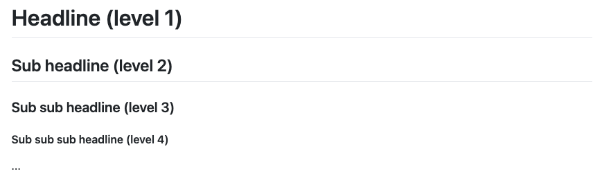

# Basic Markdown Syntax

> Overview over the most common and basic markdown commands and their syntax. Intended as a quick reference and showcase (cheatsheet).

## Table of Contents

<details>
  <!-- <summary><h1 style="display:inline;">Table of Contents</h1></summary> -->
  <summary>Click to show TOC</summary>
  <p>

- [Basic Markdown Syntax](#basic-markdown-syntax)
  - [Table of Contents](#table-of-contents)
  - [Headlines](#headlines)
  - [Emphasizing text](#emphasizing-text)
  - [Horizontal Rules](#horizontal-rules)
  - [Links](#links)
    - [Linking to Heading IDs](#linking-to-heading-ids)
    - [Linking objects (like images)](#linking-objects-like-images)
  - [Images](#images)
    - [Loading images from local file system](#loading-images-from-local-file-system)
    - [Loading images from remote URL](#loading-images-from-remote-url)
    - [Images as Link](#images-as-link)
  - [Table of contents (TOC)](#table-of-contents-toc)
    - [Markdown plugins for Visual Studio Code](#markdown-plugins-for-visual-studio-code)
  - [Tables](#tables)
  - [Lists](#lists)
    - [Unordered lists](#unordered-lists)
    - [Ordered lists](#ordered-lists)
    - [Checklists](#checklists)
    - [Numbered Lists](#numbered-lists)
      - [Manual counting](#manual-counting)
      - [Auto counting](#auto-counting)
        - [Example: Terminating a Callout Using Two Empty Lines (auto count)](#example-terminating-a-callout-using-two-empty-lines-auto-count)
        - [List termination](#list-termination)
          - [List A](#list-a)
          - [List B](#list-b)
    - [Nested list](#nested-list)
    - [Bullet list](#bullet-list)
    - [Resources list](#resources-list)
    - [Definition lists](#definition-lists)
  - [Blockquotes](#blockquotes)
    - [Blockquotes with multiple paragraphs](#blockquotes-with-multiple-paragraphs)
    - [Nested blockquotes](#nested-blockquotes)
  - [Backslash escapes for special characters](#backslash-escapes-for-special-characters)
  - [CODE](#code)
    - [Single lines of code](#single-lines-of-code)
    - [Code blocks](#code-blocks)
      - [Line indention](#line-indention)
      - [Backticks or tildes](#backticks-or-tildes)
        - [Enclosing with backticks](#enclosing-with-backticks)
        - [Enclosing with tilde characters](#enclosing-with-tilde-characters)
    - [Code highlighting](#code-highlighting)
  - [CREDITS](#credits)
  - [License](#license)

</p>
</details>

## Headlines

```markdown
# Headline            (level 1)
## Sub headline       (level 2)
### Sub headline      (level 3)
...                      ...
###### Sub headline   (level 6)
```

<!--

-->

## Emphasizing text

To emphasize text use:

+ *italic*: use `*italic*` OR `_italic_`
+ **bold**: use `**bold**` OR `__bold__`
+ ***bold and italic***: use `***bold and italic***` OR `___bold and italic___`
+ to *nest one **inside** the other*: use `*nest one **inside** the other*` OR `_nest one __inside__ the other_`
+ ~~strikethrough~~: use `~~strikethrough~~`
+ ++underline++

Because different markdown interpreters handle underscores different it's best practice to **avoid using underscores** (_). Use asterisks (*) instead when writing markdown!

## Horizontal Rules

To create a horizontal rule, use three or more asterisks (***), dashes (---), or underscores (___) on a line by themselves. The rendered output of all three looks identical.

```markdown
***

---

_________________
```

## Links

```markdown
[Link text](http://some.url.com "Link title")

[Link text](#inner-text-link "Link title")

[Link text<a name="#inner-text-anchor">](#inner-text-link "Link title")
```

+ [Some test link](http://some.url.com "Link title")
+ [Inner text link](#MAIO-plugin "Inner text link to MAIO plugin")

### Linking to Heading IDs

You can link to headings with custom IDs in the file by creating a standard link with a number sign (#) followed by the custom heading ID.

```markdown
[Heading IDs](#heading-ids)
```

Other websites can link to the heading by adding the custom heading ID to the full URL of the webpage (e.g, [Heading IDs](https://www.markdownguide.org/extended-syntax#heading-ids)).

### Linking objects (like images)

Just enclose the "link part" of an [image link](#images) with another pair of square brackets

```markdown
[](#code)
```

[](#code)

## Images

### Loading images from local file system

To include an image from the local file system just put a "!" (exclamation mark) in front of a decent markdown [text link](#links). 

```markdown

```

**Output**


Alternatively just use "old school" HTML syntax, where you can also set any required image dimensions:

```html

```

**Output**


### Loading images from remote URL

```markdown

```


### Images as Link

```markdown
[](#link-URL)
```

[](#link-URL)

## Table of contents (TOC)

* using "Markdown All in One" plugin for VSCode:
  + navigate to the place in your markdown file where you want to have your TOC created and set your cursor there
  + press **Shift + Command + P** to open the VSCode command prompt
  + type >**Create Table of Contents** => DONE
  + TOC is automatically updated on file save by default

### Markdown plugins for Visual Studio Code

+  [Markdown All in One<a name="MAIO-plugin" />](https://marketplace.visualstudio.com/items?itemName=yzhang.markdown-all-in-one "Get Markdown All in One plugin on Visual Studio Marketplace") (Visual Studio Marketplace)

+  [Markdown + Math<a name="MM-plugin">](https://marketplace.visualstudio.com/items?itemName=goessner.mdmath "Get Markdown + Math plugin on Visual Studio Marketplace") (Visual Studio Marketplace)

+  [markdownlint<a name="ML-plugin">](https://marketplace.visualstudio.com/items?itemName=DavidAnson.vscode-markdownlint "Get markdownlint plugin on Visual Studio Marketplace") (Visual Studio Marketplace)

## Tables

**markdown**

```markdown
| left | center | right |
| :--- | :----: | ----: |
| 1    |   2    |     3 |
| 4    |   5    |     6 |
| 7    |   8    |     9 |
```

* If you have the [Markdown All in One](#MAIO-plugin) plugin installed you can format a table like so:
  * First mark the table, then press 'Shift + Command + F' to format the table

**result**

| left | center | right |
| :--- | :----: | ----: |
| 1    |   2    |     3 |
| 4    |   5    |     6 |
| 7    |   8    |     9 |

## Lists

### Unordered lists

To start an unordered list simple use one of the following characters:

+ \* an asterisk starts an unordered list
+ \* and this is another item in the list
+ \+ alternatively use the \+ character to start an unordered list
+ \- the \- character can also be used to start an unordered list

### Ordered lists

To start an ordered list, write this:

```markdown
1. this starts a list *with* numbers
+  this will show as number "2"
*  this will show as number "3."
9. any number, +, -, or * will keep the list going.
    * just indent by 4 spaces (or tab) to make a sub-list
        1. keep indenting for more sub lists
    * here i'm back to the second level
```

### Checklists

To start a check list, write this:

**markdown**

```markdown
- [ ] this is not checked
- [ ] this is not checked too
- [x] but THIS is checked
```

**result**

- [ ] this is not checked
- [ ] this is not checked too
- [x] but THIS is checked

### Numbered Lists

#### Manual counting

**markdown**

```markdown
1. one
2. two
3. three
```

**result**

1. one
2. two
3. three

#### Auto counting

**markdown**

```markdown
1. one
1. two
1. three
```

**result**

1. one
1. two
1. three

##### Example: Terminating a Callout Using Two Empty Lines (auto count)

1.  First list, item 1
1.  First list, item 2


1.  Second list, item 1

##### List termination

###### List A

1.  Item 1, List A
1.  Item 2, List A

###### List B

1.  Item 1, List B

### Nested list

1.  Level 1, Item 1

    1.  Level 2, Item 1

            func emptyFunc() { }

        ***

    1.  Level 2, Item 2

1.  Level 1, Item 2

### Bullet list

- paragraph:

  - with:

    linebreak (1 line space between)

  - and here:
    without linebreak

### Resources list

### Definition lists

First Term
: This is the definition of the first term.

Second Term
: This is one definition of the second term.
: This is another definition of the second term.

## Blockquotes

To create a blockquote, add a > in front of a paragraph.

```markdown
> Dorothy followed her through many of the beautiful rooms in her castle.
```

> Dorothy followed her through many of the beautiful rooms in her castle.

### Blockquotes with multiple paragraphs

```markdown
> Dorothy followed her through many of the beautiful rooms in her castle.
>
> The Witch bade her clean the pots and kettles and sweep the floor and keep the fire fed with wood.
```

> Dorothy followed her through many of the beautiful rooms in her castle.
>
> The Witch bade her clean the pots and kettles and sweep the floor and keep the fire fed with wood.

### Nested blockquotes

Blockquotes can be nested. Add a >> in front of the paragraph you want to nest.

```markdown
> Dorothy followed her through many of the beautiful rooms in her castle.
>
>> The Witch bade her clean the pots and kettles and sweep the floor and keep the fire fed with wood.
```

> Dorothy followed her through many of the beautiful rooms in her castle.
>
>> The Witch bade her clean the pots and kettles and sweep the floor and keep the fire fed with wood.

## Backslash escapes for special characters

\\   backslash

\`   backtick (escape backtick character in [code](#escape-backtick-code "Link: how to escape backtick in markdown code block"))

\*   asterisk

\_   underscore

\{\}  curly braces

\[\]  square brackets

\(\)  parentheses

\#   hash mark

\+   plus sign

\-   minus sign (hyphen)

\.   dot

\!   exclamation mark

| character | code  | description                                                                                                                 |
| :-------: | :---: | :-------------------------------------------------------------------------------------------------------------------------- |
|    \\     | `\\`  | backslash                                                                                                                   |
|    \`     |       | backtick (escape backtick character in [code](#escape-backtick-code "Link: how to escape backtick in markdown code block")) |
|     7     |   8   | 9                                                                                                                           |

## CODE

### Single lines of code

```markdown
`a single line of code`
```

`single line code block`

### Code blocks

To create code blocks, there are several ways.

#### Line indention

Indent every line of the block by at least four spaces or one tab.

**Markup**

~~~markdown
....{
......"firstName": "John",
......"lastName": "Smith",
......"age": 25
....}
~~~

**Output**

    {
      "firstName": "John",
      "lastName": "Smith",
      "age": 25
    }

#### Backticks or tildes

To form code blocks in Markdown, the code can be enclosed between certain special characters. This is why these code blocks are called "fenced code blocks".

##### Enclosing with backticks

To enclose the code you want to display use ***three backticks*** (```) followed by a ***linebreak*** at the beginning *and* the end of your code.

**Markdown**

~~~markdown
```
{
  "firstName": "John",
  "lastName": "Smith",
  "age": 25
}
```
~~~

**Output**

```markdown
{
  "firstName": "John",
  "lastName": "Smith",
  "age": 25
}
```

##### Enclosing with tilde characters

To enclose the code you want to display use ***three tilde characters*** (~~~) followed by a ***linebreak*** at the beginning *and* the end of your code.

**Markdown**

```markdown
~~~
{
  "firstName": "John",
  "lastName": "Smith",
  "age": 25
}
~~~
```

**Output**

~~~markdown
{
  "firstName": "John",
  "lastName": "Smith",
  "age": 25
}
~~~

### Code highlighting

Many markdown processors support syntax highlighting for fenced code blocks. This feature allows you to add color highlighting for whatever language your code was written in. To add syntax highlighting, specify a language next to the backticks or tildes before the fenced code block.

+ [Samples](https://sourceforge.net/p/tabulator/wiki/markdown_syntax/#md_ex_code "External link")
+ [Link](https://www.markdownguide.org/extended-syntax/#syntax-highlighting)

JSON code

~~~markdown
```json
{
  "firstName": "John",
  "lastName": "Smith",
  "age": 25
}
```
~~~

**Output**

```json
{
  "firstName": "John",
  "lastName": "Smith",
  "age": 25
}
```

HTML code

~~~markdown
```html
<ul>
  <li>
    <a href="#">My code</a>
  </li>
</ul>
```
~~~

**Output**

```html
<ul>
  <li>
    <a href="#">My code</a>
  </li>
</ul>
```

JavaScript code

~~~markdown
```js
const Complex = require('Complex');
console.log(new Complex(3, 4).abs()); // 5
```
~~~

**Output**

```js
const Complex = require('Complex');
console.log(new Complex(3, 4).abs()); // 5
```

Python code

~~~markdown
```py
#!/usr/bin/python
import abc
```
~~~

**Output**

```py
#!/usr/bin/bash
import abc
```

Script code with leading shebang (here: bash script)

~~~markdown
```bash
#!/usr/bin/bash

# maintain bash profiles that work on BOTH, Linux and MacOS
[[ -f ~/.bashrc ]] && . ~/.bashrc
```
~~~

**Output**

```bash
#!/usr/bin/bash

# maintain bash profiles that work on BOTH, Linux and MacOS
[[ -f ~/.bashrc ]] && . ~/.bashrc
```

## CREDITS

> For more complete info, please see:

- [Markdown Guide](https://www.markdownguide.org/)
- [John Gruber's original markdown spec](https://daringfireball.net/projects/markdown/)
- [GitHub Flavoured Markdown Spec](https://github.github.com/gfm/)
- [Basic writing and formatting syntax in GitHub](https://docs.github.com/en/github/writing-on-github/basic-writing-and-formatting-syntax)
- [Online Markdown editor "Dillinger"](https://dillinger.io/)

## License

Published under the [MIT Licence](LICENSE.md)
